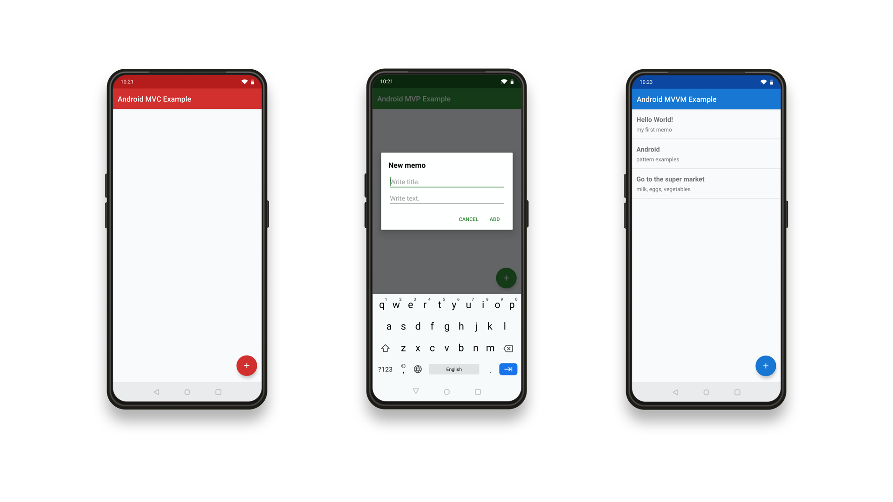

# Android Pattern Examples

Example implementations of a simple memo app using Kotlin.

## Used Patterns

* [MVC](https://github.com/rulyox/android-mvc-example)
* [MVP](https://github.com/rulyox/android-mvp-example)
* [MVVM](https://github.com/rulyox/android-mvvm-example)
